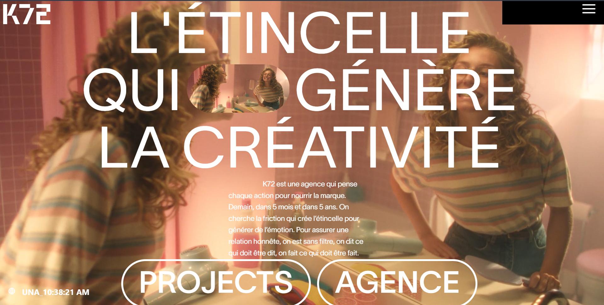
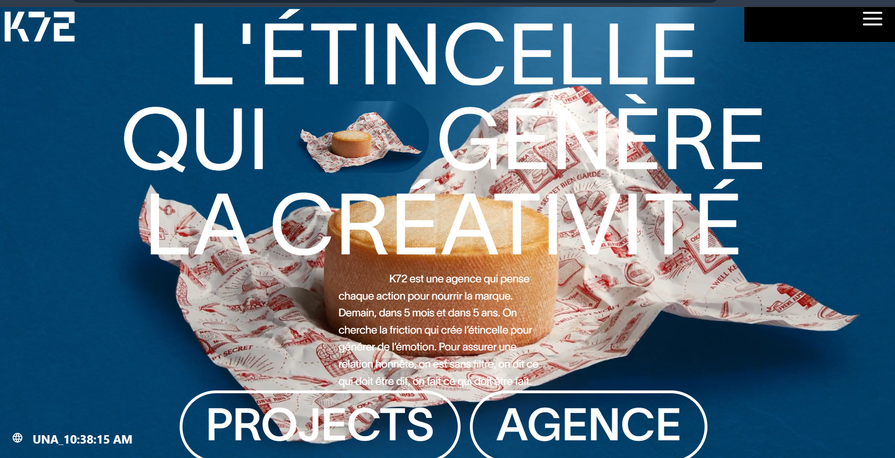
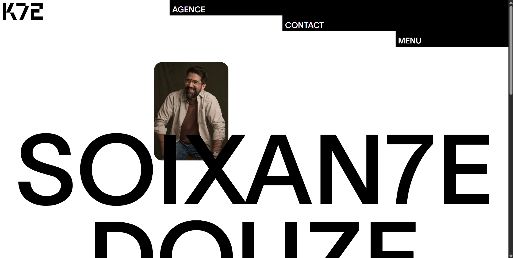
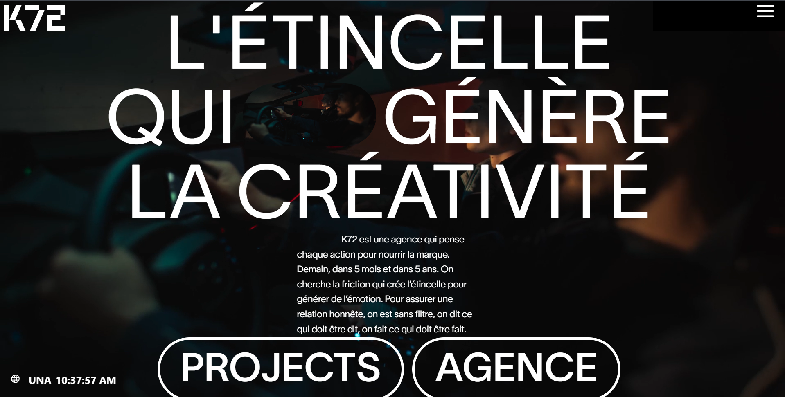

# K72agency Clone

A static React + Vite website built as a learning project for web animations, smooth scrolling, GSAP motion, and modern web design.

## Live Demo

https://k72agency-clone.netlify.app

## Project Purpose

This repository is a practice clone intended to help improve skills in:

- web animation workflows with GSAP
- smooth scrolling and page transitions
- responsive UI design for different devices
- component-based structure using React

## What’s Included

- static website built with React and Vite
- animated sections and interactions using GSAP
- custom smooth scrolling behavior
- responsive layouts for desktop, tablet, and mobile
- design-focused content presentation

## Key Features

- GSAP-driven animations for page elements
- fluid scroll experience throughout the page
- responsive navigation and content panels
- reusable React components for sections and UI blocks
- static deployment-ready for Netlify

## Folder Structure

- `src/` - source application code
- `src/App.jsx` - main application shell
- `src/main.jsx` - React entry point
- `src/component/` - reusable UI components
- `src/pages/` - page sections and content views
- `public/` - public assets, including screenshots and media

## Screenshots

Below are a few screenshots from the live site to show the current UI and animation design:









## Running Locally

1. Install dependencies
   ```bash
   npm install
   ```
2. Start the development server
   ```bash
   npm run dev
   ```
3. Open the local URL shown in your terminal.

## Notes

This project is not a fully polished production site. It is a hands-on practice project focused on animation techniques, smooth page flow, and responsive front-end design.

## Credits

Built as a learning clone to explore front-end animation and web design best practices.
